# 🏦 DeFi Protocol Designer Review v1: Bugtopia EvoChain Economics

## 🎯 Executive Assessment

**Protocol Classification**: **Innovative Gaming-DeFi Hybrid with Scientific Utility**  
**Risk Rating**: **Medium-High** (Novel mechanics, unproven market)  
**Innovation Score**: **9/10** (Pioneering EvoChain category)  
**Sustainability Outlook**: **Promising** (Strong utility foundation)

### 🌟 Core Innovation Analysis

Bugtopia represents a paradigm shift from traditional GameFi models by creating **intrinsic value generation through evolutionary simulation**. Unlike speculative play-to-earn mechanics, the protocol derives value from:

1. **Scientific Research Data**: Evolutionary algorithms generate valuable AI training datasets
2. **Educational Licensing**: Academic partnerships monetize simulation complexity
3. **Emergent Behavior Discovery**: Novel AI behaviors have commercial applications
4. **Computational Resource Utilization**: Distributed evolution processing

This creates a **sustainable value foundation** independent of token speculation.

---

## 💰 Tokenomics Architecture Assessment

### 🪙 $BUG Token Analysis

**Strengths**:
- ✅ **Native L1 Implementation**: Gas token creates circular economy
- ✅ **Deflationary Design**: 15-30% burn rates on utility functions
- ✅ **Diverse Utility Matrix**: 8 distinct use cases with varying burn rates
- ✅ **Staking Yield Sources**: Multiple revenue streams support APY

**Concerns**:
- ⚠️ **High Initial Supply**: 1B tokens may create selling pressure
- ⚠️ **Emission vs Burn Balance**: 2% annual emission needs careful monitoring
- ⚠️ **Utility Adoption Risk**: Burns depend on feature usage

**Recommendation**: Implement **dynamic emission adjustment** based on burn rate performance.

### 🧬 NFT Ecosystem Design

**Exceptional Innovation**:
- ✅ **Organic Rarity System**: Algorithmic rarity based on evolutionary performance
- ✅ **Utility-First Design**: Every NFT has in-game functionality
- ✅ **Provable Scarcity**: Minting tied to actual achievements
- ✅ **Ancestry Tracking**: Creates collectible lineage value

**Risk Mitigation Needed**:
- ⚠️ **Floor Price Stability**: Need utility-based price floors
- ⚠️ **Metadata Permanence**: IPFS pinning strategy required

---

## 🏗️ Protocol Architecture Evaluation

### 🎯 Multi-Token Ecosystem

```mermaid
graph TB
    subgraph "Value Creation Layer"
        SIM[🧬 Evolutionary Simulation]
        DATA[📊 Research Data]
        EDU[🎓 Educational Content]
    end
    
    subgraph "Token Layer"
        BUG[🪙 $BUG Utility Token]
        DNA[🧬 Bug DNA NFTs]
        LAND[🌍 Territory NFTs]
        ART[🔧 Artifact NFTs]
    end
    
    subgraph "Revenue Streams"
        BREED[💕 Breeding Fees]
        ARENA[⚔️ Tournament Entry]
        STAKE[📈 Territory Staking]
        LICENSE[📜 Data Licensing]
    end
    
    SIM --> BUG
    DATA --> LICENSE
    EDU --> LICENSE
    BUG --> DNA
    BUG --> LAND
    BUG --> ART
    BREED --> BUG
    ARENA --> BUG
    STAKE --> BUG
    LICENSE --> BUG
```



**Architecture Strengths**:
- ✅ **Clear Value Flows**: Each token has distinct utility
- ✅ **Circular Economy**: Revenue feeds back into ecosystem
- ✅ **Composability**: Tokens interact meaningfully
- ✅ **Scalable Design**: Can expand to new game modes

---

## 🛡️ Risk Analysis & Security Assessment

### 🚨 Economic Attack Vectors

| Attack Type | Probability | Impact | Mitigation Status |
|-------------|-------------|---------|-------------------|
| **Breeding Farm Exploitation** | Medium | High | ⚠️ Needs cooldown mechanisms |
| **Arena Manipulation** | Low | Medium | ✅ Randomized matchmaking |
| **Governance Capture** | Medium | High | ⚠️ Quadratic voting needed |
| **Oracle Price Manipulation** | Low | High | ✅ Multiple price feeds planned |
| **Flash Loan Attacks** | Low | Medium | ✅ Time delays on critical functions |

### 🔒 Security Recommendations

**Critical Implementations Needed**:

1. **Breeding Rate Limits**: Prevent industrial farming
   ```solidity
   mapping(address => uint256) public lastBreedingTime;
   uint256 public constant BREEDING_COOLDOWN = 24 hours;
   ```

2. **Governance Time Delays**: Protect against hostile takeovers
   ```solidity
   uint256 public constant PROPOSAL_DELAY = 7 days;
   uint256 public constant EXECUTION_DELAY = 48 hours;
   ```

3. **Emergency Circuit Breakers**: Pause critical functions
   ```solidity
   modifier whenNotPaused() {
       require(!paused, "Protocol paused");
       _;
   }
   ```

---

## 📊 Economic Modeling & Sustainability

### 🎯 Token Velocity Analysis

**Current Design Issues**:
- High utility burn rates may create **deflationary spiral**
- Tournament rewards create **selling pressure**
- Staking rewards may not offset utility burns

**Optimization Recommendations**:

1. **Dynamic Burn Rate Adjustment**:
   ```
   Burn Rate = Base Rate × (1 - Staking Ratio) × Velocity Factor
   ```

2. **Staking Incentive Scaling**:
   ```
   APY = Base APY × (Total Staked / Total Supply)^0.5
   ```

3. **Revenue Sharing Optimization**:
   ```
   Staker Share = 60% of protocol revenue
   Treasury Share = 25% of protocol revenue  
   Burn Share = 15% of protocol revenue
   ```

### 💎 Liquidity Engineering Strategy

**Bootstrap Phase** (Months 1-6):
- **Protocol-Owned Liquidity**: 40% of initial treasury
- **Liquidity Mining**: 5% annual emission rate
- **Bonding Program**: Discounted $BUG for LP tokens

**Growth Phase** (Months 6-18):
- **Reduce Emissions**: Taper to 2% annually
- **Fee Tier Optimization**: Dynamic fees based on volatility
- **Cross-Chain Expansion**: Polygon and Arbitrum deployment

**Maturity Phase** (18+ months):
- **Self-Sustaining Liquidity**: Fee revenue covers incentives
- **Buyback Program**: Excess revenue for token buybacks
- **Governance Transition**: Community-controlled parameters

---

## 🎮 Game Theory & Incentive Design

### 🏆 Player Behavior Analysis

**Positive Feedback Loops**:
- ✅ Successful breeding → Better NFTs → Higher tournament success → More $BUG
- ✅ Territory ownership → Revenue sharing → More staking power → Better territories
- ✅ Long-term play → Species development → Rare NFTs → Collector value

**Potential Exploitation Vectors**:
- ⚠️ **Bot Farming**: Automated breeding for profit
- ⚠️ **Whale Dominance**: Large holders controlling tournaments
- ⚠️ **Speculation Bubbles**: NFT price disconnected from utility

### 🛠️ Mechanism Design Improvements

**Anti-Bot Measures**:
```solidity
// Require minimum interaction time
mapping(address => uint256) public totalPlayTime;
modifier requireEngagement() {
    require(totalPlayTime[msg.sender] > MIN_PLAY_TIME, "Insufficient engagement");
    _;
}
```

**Whale Mitigation**:
```solidity
// Tournament entry caps based on holdings
function getMaxTournamentEntries(address user) public view returns (uint256) {
    uint256 balance = bugToken.balanceOf(user);
    return Math.min(balance / ENTRY_THRESHOLD, MAX_ENTRIES_PER_USER);
}
```

---

## 📈 Revenue Model & Sustainability

### 💰 Revenue Stream Analysis

| Revenue Source | Sustainability | Growth Potential | Implementation Risk |
|----------------|---------------|------------------|-------------------|
| **Breeding Fees** | High | Medium | Low |
| **Tournament Entry** | Medium | High | Medium |
| **Territory Staking** | High | Medium | Low |
| **Data Licensing** | Very High | Very High | High |
| **Educational Partnerships** | High | High | Medium |
| **NFT Royalties** | Medium | Medium | Low |

**Key Insights**:
- **Data Licensing** offers highest long-term value but requires business development
- **Tournament Economy** has viral growth potential but needs careful balancing
- **Territory System** provides stable yield foundation

### 🎯 Monetization Optimization

**Short-term (0-12 months)**:
- Focus on breeding and tournament revenue
- Build user base through engaging gameplay
- Establish NFT marketplace liquidity

**Medium-term (1-3 years)**:
- Develop data licensing partnerships
- Launch educational content programs
- Expand to multiple game modes

**Long-term (3+ years)**:
- Scientific research collaborations
- AI training dataset marketplace
- Metaverse integration opportunities

---

## 🎖️ Final Assessment

### 🌟 Protocol Score: 8.2/10

**Strengths**:
- Revolutionary concept with real utility foundation
- Sophisticated tokenomics with multiple value accrual mechanisms
- Strong technical implementation with 3D evolution simulation
- Clear path to sustainable revenue generation
- Educational and scientific value creates institutional demand

**Areas for Improvement**:
- Complex mechanics may hinder mainstream adoption
- High token supply creates potential selling pressure
- Cross-chain strategy introduces significant risks
- Governance model needs refinement for security
- Market education required for novel concept

### 🚀 Investment Thesis

**Bugtopia represents the evolution of GameFi from speculative mechanics to sustainable utility.** The protocol's foundation in evolutionary science creates intrinsic value independent of token speculation, while the sophisticated tokenomics provide multiple revenue streams and value accrual mechanisms.

**Key Success Factors**:
1. **Execution Quality**: Technical implementation must match ambitious vision
2. **Community Building**: Early adopters need deep engagement tools
3. **Partnership Development**: Academic and research collaborations are critical
4. **Market Education**: Novel concept requires significant user education
5. **Economic Balancing**: Token mechanics need continuous optimization

**Risk-Adjusted Recommendation**: **STRONG BUY** for investors seeking exposure to next-generation GameFi protocols with sustainable utility foundations.

---

## 📋 Critical Recommendations Summary

### 🚨 Immediate Actions Required

1. **Implement Rate Limiting**: Prevent breeding farm exploitation
2. **Design Governance Delays**: Protect against hostile takeovers  
3. **Create Emergency Controls**: Circuit breakers for critical functions
4. **Develop Bridge Security**: Multi-sig with time delays
5. **Build Price Oracle System**: Multiple feeds with manipulation resistance

### 🎯 Strategic Optimizations

1. **Dynamic Tokenomics**: Adjust parameters based on usage metrics
2. **Liquidity Engineering**: Protocol-owned liquidity strategy
3. **Partnership Development**: Academic and research collaborations
4. **User Experience**: Simplify onboarding and reduce complexity
5. **Community Governance**: Gradual decentralization pathway

---

**Document Version**: 1.0  
**Review Date**: January 2025  
**Reviewer**: DeFi Protocol Designer  
**Next Review**: Q2 2025 (Post-MVP Launch)

---

*🏦 "Bugtopia transforms the GameFi landscape by creating sustainable value through evolutionary science, establishing a new paradigm where entertainment, education, and economics converge in a self-reinforcing ecosystem." 🧬*