# Bugtopia Genetics Deep Dive: Digital DNA & Evolution

## 🧬 Overview

Bugtopia implements a sophisticated **digital genetics system** that goes far beyond simple ACGT sequences. Instead of biological DNA, bugs carry **neural network parameters**, **behavioral traits**, and **physical characteristics** that can evolve through crossover, mutation, and natural selection.

## 📊 The DNA Structure

### 🧬 What Does BugDNA Actually Look Like?

```swift
struct BugDNA {
    // Physical traits (8 values)
    speed: 1.23, visionRadius: 67.4, energyEfficiency: 0.87, size: 1.1, 
    strength: 0.95, memory: 0.73, stickiness: 1.05, camouflage: 0.44
    
    // 3D Movement (5 values)  
    wingSpan: 0.31, divingDepth: 0.88, climbingGrip: 0.12, 
    altitudePreference: -0.23, pressureTolerance: 0.67
    
    // Behavioral (2 values)
    aggression: 0.34, curiosity: 0.78
    
    // Neural Network (hundreds of values!)
    neuralDNA: {
        topology: [71, 24, 16, 10],  // 71 inputs → 24 → 16 → 10 outputs
        weights: [0.23, -0.45, 1.12, ...], // ~2000+ connection weights
        biases: [0.11, -0.23, ...],        // ~50 bias values
        activations: [sigmoid, tanh, relu, linear]
    }
    
    // Additional complex traits
    speciesTraits: { speciesType, huntingBehavior, defensiveBehavior, energyGains }
    communicationDNA: { signalStrength, signalSensitivity, socialResponseRate, signalTrust }
    toolDNA: { toolCrafting, constructionDrive, engineeringIntelligence, collaboration }
    visualTraits: { colorHue, colorSaturation, colorBrightness }
}
```

### 🧠 Neural Networks: The Real "DNA"

The **neural network component** is the most complex part of a bug's genetics:

- **71 sensory inputs**: Vision, energy, seasons, weather, disasters, territory, 3D spatial awareness
- **10 motor outputs**: Movement direction, speed, reproduction desire, hunting, communication
- **Up to 8 hidden layers** with up to 32 neurons each
- **2000+ evolving parameters** including weights, biases, and activation functions
- **Evolvable topology**: Network structure itself can evolve

## 🔄 Genetic System Architecture

```mermaid
graph TD
    subgraph "🧬 BUGTOPIA DNA STRUCTURE"
        DNA["BugDNA Struct"] --> Physical["🏃 Physical Traits<br/>speed: 0.1-2.0<br/>visionRadius: 10-100<br/>energyEfficiency: 0.5-1.5<br/>size: 0.5-2.0<br/>strength: 0.2-1.5"]
        DNA --> Movement3D["🌍 3D Movement<br/>wingSpan: 0.0-1.0<br/>divingDepth: 0.0-1.0<br/>climbingGrip: 0.0-1.0<br/>altitudePreference: -1.0-1.0"]
        DNA --> Behavioral["🧠 Behavioral<br/>aggression: 0.0-1.0<br/>curiosity: 0.0-1.0<br/>memory: 0.1-1.2<br/>camouflage: 0.0-1.0"]
        DNA --> Neural["🤖 Neural Network<br/>topology: [71,hidden...,10]<br/>weights: [Double]<br/>biases: [Double]<br/>activations: [Type]"]
        DNA --> Species["🦋 Species Traits<br/>speciesType: herbivore/carnivore<br/>huntingBehavior<br/>defensiveBehavior<br/>energyGains"]
        DNA --> Communication["📡 Communication<br/>signalStrength<br/>signalSensitivity<br/>socialResponseRate<br/>signalTrust"]
        DNA --> Tools["🔨 Tool Use<br/>toolCrafting<br/>constructionDrive<br/>engineeringIntelligence<br/>collaborationTendency"]
        DNA --> Visual["🎨 Visual<br/>colorHue: 0.0-1.0<br/>colorSaturation: 0.3-1.0<br/>colorBrightness: 0.4-1.0"]
    end

    subgraph "💘 SCENARIO 1: BREEDING"
        Bug1["Bug A<br/>💚 Energy > 50<br/>❤️ Neural desire: 0.8"] --> Compatible{Compatible?<br/>Distance < vision<br/>Repro compatibility > 0.3}
        Bug2["Bug B<br/>💚 Energy > 50<br/>❤️ Neural desire: 0.7"] --> Compatible
        Compatible -->|Yes| Crossover["🧬 CROSSOVER<br/>Each trait: 50% chance from each parent<br/>speed: A or B?<br/>vision: A or B?<br/>neuralDNA: complex crossover"]
        Crossover --> Mutation1["🎲 MUTATION<br/>Rate: 10% per trait<br/>Strength: ±15%<br/>Neural: ±30%"]
        Mutation1 --> Offspring["👶 Child Bug<br/>Position: midpoint of parents<br/>Generation: max(A,B) + 1<br/>Energy: 100"]
    end

    subgraph "🚨 SCENARIO 2: POPULATION RESPAWN"
        PopCount["Population < 2 bugs"] --> GetSurvivors["Sort by energy<br/>Pick best survivors"]
        GetSurvivors --> Clone["Clone + Mutate<br/>10+ new bugs needed"]
        Clone --> Mutation2["🎲 HEAVY MUTATION<br/>Rate: 30% per trait<br/>Strength: ±20%<br/>Create genetic diversity"]
        Mutation2 --> Respawned["New bugs at world center<br/>Same generation<br/>Fresh energy: 100"]
    end

    subgraph "🔄 SCENARIO 3: NEW GENERATION"
        GenTrigger["1500 ticks OR<br/>Population < 2"] --> FitnessCalc["Calculate fitness<br/>Age + Energy + Survival time"]
        FitnessCalc --> Selection["🏆 SELECTION<br/>Elite: 10% auto-survive<br/>Tournament: 30% total survive<br/>Tournament size: 3"]
        Selection --> Survivors["6 survivors from 20 bugs"]
        Survivors --> FillPop["Fill to 20 bugs<br/>Crossover + mutation<br/>from survivor pairs"]
        FillPop --> Mutation3["🎲 STANDARD MUTATION<br/>Rate: 10% per trait<br/>Strength: ±15%<br/>Position: near parents"]
        Mutation3 --> NewGen["Generation N+1<br/>Fresh energy: 100<br/>Age reset to 0"]
    end
```



## 🧬 Three Evolution Scenarios

### 💘 Scenario 1: Breeding (Sexual Reproduction)

**Prerequisites:**
- Both bugs must have `energy > 50` (reproduction cost)
- Must be within visual range of each other  
- Neural networks must both "desire" reproduction (neural output > random threshold)
- Reproductive compatibility > 0.3 (species/trait similarity)

**DNA Inheritance (Uniform Crossover):**
```swift
// Each trait has exactly 50% chance from each parent
childDNA = BugDNA(
    speed: coinFlip() ? parent1.speed : parent2.speed,           // Could be 1.2 or 0.8
    visionRadius: coinFlip() ? parent1.visionRadius : parent2.visionRadius, // Could be 45 or 83
    // ... for ALL 25+ traits independently
    
    // Neural network does complex crossover of weights/biases
    neuralDNA: NeuralDNA.crossover(parent1.neural, parent2.neural)
)
```

**Mutation (10% rate, ±15% strength):**
```swift
// Each trait has 10% chance to mutate
if random() < 0.1 {
    speed = speed + random(-0.15, +0.15)  // 1.2 → might become 1.05 or 1.35
}
```

**Result:**
- Child gets mix of both parents + small random mutations
- Parents pay 50 energy each  
- Child spawns at midpoint between parents with 100 energy
- Generation = max(parent1.generation, parent2.generation) + 1

### 🚨 Scenario 2: Population Respawn (< 2 bugs)

**Trigger:** When population drops below 2 bugs (emergency repopulation)

**Process:**
- Takes the best surviving bug (highest energy)
- **No crossover** - only cloning + heavy mutation
- Creates 10+ new bugs to restore population

**Heavy Mutation (30% rate, ±20% strength):**
```swift
// Much more aggressive mutations for genetic diversity
mutatedDNA = survivor.dna.mutated(mutationRate: 0.3, mutationStrength: 0.2)

// Many traits will change:
speed: 1.2 → 1.4 (30% chance of ±20% change)
visionRadius: 60 → 52 (30% chance)
neuralWeights: [0.23, -0.45, ...] → [0.31, -0.38, ...] (many weights change)
```

**Result:**
- Creates 10+ new bugs from 1 survivor
- High genetic diversity due to heavy mutations
- Same generation (no advancement)
- All spawn at world center
- Emergency measure to prevent extinction

### 🔄 Scenario 3: New Generation (Normal Evolution)

**Trigger:** Every 1500 ticks (≈50 seconds) OR population < 2

**Selection Process:**
1. **Fitness Calculation**: `age + energy + survivalTime + terrainAdaptation`
2. **Elite Selection**: Top 10% automatically survive (2 bugs from 20)
3. **Tournament Selection**: 3-bug tournaments fill remaining slots until 30% total survive (6 total survivors)

**Population Regeneration:**
```swift
// Survivors get refreshed
for survivor in survivors {
    survivor.energy = 100  // Full energy restore
    survivor.age = 0       // Reset age
    // DNA stays identical - no changes
}

// Fill remaining 14 slots with crossover offspring
while newPopulation.count < 20 {
    parent1 = randomSurvivor()
    parent2 = randomSurvivor() 
    childDNA = BugDNA.crossover(parent1.dna, parent2.dna).mutated() // Standard 10% mutation
}
```

**Result:**
- 6 survivors with identical DNA, refreshed energy
- 14 offspring with mixed DNA from survivor pairs + mutations
- Generation advances: N → N+1
- Offspring spawn near parents (not world center)
- Represents successful generational evolution

## 🎲 Mutation System

### Mutation Rates by Context:

| Scenario | Mutation Rate | Mutation Strength | Purpose |
|----------|---------------|-------------------|---------|
| **Normal Breeding** | 10% | ±15% | Gentle evolution |
| **Respawn Crisis** | 30% | ±20% | Rapid adaptation |
| **Neural Networks** | 10% | ±30% | Brain plasticity |
| **Species Traits** | 15% | ±20% | Behavioral evolution |

### Trait-Specific Ranges:

| Trait Category | Range | Clamping |
|----------------|-------|----------|
| **Speed** | 0.1 - 2.0 | Hard limits |
| **Vision Radius** | 10 - 100 | Hard limits |
| **Energy Efficiency** | 0.5 - 1.5 | Lower = better |
| **Neural Weights** | Unlimited | No clamping |
| **Aggression** | 0.0 - 1.0 | Soft behavioral trait |

## 🏆 Fitness & Selection

### Fitness Calculation:
```swift
fitness = age * 0.3 + energy * 0.4 + survivalTime * 0.3 + terrainAdaptation
```

### Selection Methods:
- **Elite Selection**: Top performers always survive
- **Tournament Selection**: Random 3-bug competitions
- **Reproductive Selection**: Neural desire + compatibility
- **Natural Selection**: Starvation, predation, disasters

## 🚀 Evolutionary Pressure & Adaptation

### With Reduced Food (Current State):
1. **Increased Starvation**: Poor foragers die faster
2. **More Respawns**: Population crashes trigger heavy mutation bursts
3. **Neural Selection**: Better food-finding neural networks survive
4. **Rapid Evolution**: Higher turnover = faster adaptation

### Expected Evolutionary Outcomes:
- **Enhanced Foraging**: Neural networks optimize food detection
- **Energy Efficiency**: Selection for lower energy consumption
- **Memory Optimization**: Better spatial memory for food locations
- **Cooperative Behavior**: Potential evolution of food sharing
- **Specialized Species**: Different ecological niches emerge

## 📈 Performance & Complexity

### Computational Cost:
- **Simple Traits**: ~25 floating-point values per bug
- **Neural Networks**: ~2000+ parameters per bug
- **Complex Crossover**: Specialized algorithms for each trait type
- **Population Scale**: 20 bugs × 2000+ parameters = 40,000+ evolving values

### Memory Usage:
- Each bug carries its complete genetic history
- Neural networks are the largest memory consumers
- Speciation tracking adds additional complexity
- Generation statistics maintain evolution history

## 🔬 Research Applications

This system enables research into:
- **Artificial Life**: Emergent behaviors from simple rules
- **Neural Evolution**: How brain structures adapt to environments
- **Ecological Dynamics**: Predator-prey relationships, resource competition
- **Speciation**: How populations diverge into distinct species
- **Tool Use Evolution**: Development of technology and cooperation
- **Communication Evolution**: Emergence of signaling systems

## 🎯 Key Insights

1. **Digital DNA is More Complex**: With 2000+ neural parameters, bugs have more "genetic material" than many real organisms
2. **Intelligence Evolves**: Neural networks literally evolve better decision-making
3. **Multiple Inheritance**: Bugs inherit physical, behavioral, neural, and social traits
4. **Environmental Pressure Works**: Reduced food is already accelerating evolution
5. **Emergent Behaviors**: Complex behaviors emerge from simple genetic rules

The reduced food spawning has created the perfect evolutionary pressure cooker - expect to see smarter, more efficient bugs evolving within just a few generations! 🧬🚀
