# 🧬💰 Bugtopia Tokenomics Framework: Evolutionary Economics Architecture

## 🌟 Executive Summary

**Bugtopia represents a paradigm shift in blockchain gaming: the world's first EvoChain ecosystem where evolutionary success becomes tokenized value.** This framework designs a sustainable, multi-token economy that transforms digital evolution into measurable, tradeable, and stakeable assets while maintaining the core scientific integrity of the simulation.

**Core Innovation**: Unlike traditional GameFi projects that bolt tokens onto existing games, Bugtopia's tokenomics emerge organically from its evolutionary mechanics, creating authentic utility and intrinsic value generation.

---

## 🏗️ Token Architecture Overview

### 🎯 Multi-Token Ecosystem Design

```mermaid
graph TB
    subgraph "Core Ecosystem"
        BUG[🪙 $BUG - Utility Token]
        DNA[🧬 Bug DNA NFTs - ERC-721]
        LAND[🌍 Territory NFTs - ERC-721]
        ARTIFACTS[🔧 Artifact NFTs - ERC-1155]
        GENESIS[⭐ Genesis Lineage - ERC-721]
    end
    
    subgraph "Value Flows"
        BUG --> DNA
        BUG --> LAND
        BUG --> ARTIFACTS
        DNA --> BUG
        LAND --> BUG
        ARTIFACTS --> DNA
    end
    
    subgraph "Utility Sinks"
        BREEDING[🧬 Breeding Costs]
        STAKING[📈 Territory Staking]
        GOVERNANCE[🗳️ DAO Voting]
        PREMIUM[⚡ Neural Boosts]
    end
```



---

## 🪙 $BUG Token: The Evolutionary Currency

### 🎯 Token Utility Matrix

| Utility Category | Function | Economic Impact | Burn/Sink Rate |
|------------------|----------|-----------------|-----------------|
| **🧬 Breeding Fees** | Cross-species reproduction | Creates reproduction markets | 15% burned |
| **🌍 Territory Staking** | Claim biome ownership | Locks supply, generates yield | 0% burned |
| **🔧 Neural Boosts** | Accelerate AI evolution | Premium feature monetization | 25% burned |
| **🎯 Arena Entry** | Tournament participation | Competitive gameplay | 10% burned |
| **🗳️ Governance** | DAO proposal & voting | Decentralized decision making | 5% burned |
| **🛠️ Artifact Crafting** | Create enhancement items | Utility NFT generation | 20% burned |
| **⚡ Mutation Catalyst** | Force beneficial mutations | RNG manipulation | 30% burned |
| **🏆 Prize Pools** | Tournament rewards | Competitive incentives | 0% burned |

### 💎 Token Economics

**Initial Supply**: 1,000,000,000 $BUG (1B total)
**Distribution Strategy**:
- 30% - Community Rewards & Airdrops
- 25% - Development Team (4-year vesting)
- 20% - Ecosystem Development Fund
- 15% - Strategic Partners & Advisors
- 10% - Liquidity Provision & Market Making

**Supply Dynamics**:
- **Inflationary Pressure**: 2% annual emission for staking rewards
- **Deflationary Mechanisms**: 15-30% burn rate on utility functions
- **Net Supply**: Designed to be deflationary post-Year 2

---

## 🧬 Bug DNA NFTs: Tokenized Evolution

### 🎨 NFT Metadata Architecture

```json
{
  "name": "Apex Predator #42",
  "description": "Generation 156 carnivore with legendary hunting neural network",
  "image": "ipfs://QmBugSnapshot42",
  "attributes": [
    {
      "trait_type": "Generation",
      "value": 156
    },
    {
      "trait_type": "Species",
      "value": "Carnivore"
    },
    {
      "trait_type": "Neural Layers",
      "value": 8,
      "max_value": 10
    },
    {
      "trait_type": "Fitness Score",
      "value": 0.94,
      "display_type": "boost_percentage"
    },
    {
      "trait_type": "Arena Wins",
      "value": 23
    },
    {
      "trait_type": "Lineage Rarity",
      "value": "Legendary"
    },
    {
      "trait_type": "Biome Specialization",
      "value": "Volcanic Caverns"
    }
  ],
  "evolutionary_data": {
    "parent_ids": ["0x123...", "0x456..."],
    "genetic_hash": "0xabcd...",
    "neural_topology": "ipfs://QmNeuralNet42",
    "speciation_event": "Generation 134 - Thermal Adaptation",
    "survival_stats": {
      "generations_survived": 22,
      "offspring_count": 47,
      "territory_controlled": 12.3
    }
  }
}
```

### 🏆 Minting Triggers & Rarity System

**Automatic Minting Events**:
1. **Speciation** (New species formation) - Ultra Rare
2. **Generation Milestones** (50, 100, 200+ generations) - Rare
3. **Arena Championships** (Tournament victories) - Epic
4. **Perfect Fitness** (99%+ fitness score) - Legendary
5. **Lineage Founding** (First of genetic line) - Mythic

**Rarity Distribution**:
- Common (60%): Standard evolutionary milestones
- Rare (25%): Notable genetic achievements
- Epic (10%): Exceptional performance metrics
- Legendary (4%): Outstanding evolutionary success
- Mythic (1%): Genesis founders & perfect specimens

---

## 🌍 Territory System: Spatial Economics

### 🗺️ Territory NFT Framework

**Territory Types & Staking Requirements**:
- 🏜️ **Desert Plots**: 1,000 $BUG stake → 5% of biome activity fees
- 🌲 **Forest Territories**: 2,500 $BUG stake → 7% of biome activity fees  
- 🏔️ **Mountain Ranges**: 5,000 $BUG stake → 10% of biome activity fees
- 🌋 **Volcanic Zones**: 10,000 $BUG stake → 15% of biome activity fees
- 🌊 **Archipelago Islands**: 7,500 $BUG stake → 12% of biome activity fees

**Territory Revenue Streams**:
1. **Breeding Fees**: 20% of cross-species breeding in territory
2. **Resource Taxes**: 10% of resource gathering activities
3. **Arena Hosting**: Tournament venue rental fees
4. **Research Licensing**: AI training data monetization

### 🎯 Territory Governance

Territory owners gain voting power proportional to:
- Stake amount (40% weight)
- Territory rarity (30% weight)  
- Bug population activity (30% weight)

**Governance Decisions**:
- Environmental disaster frequency
- Resource spawn rates
- Seasonal cycle timing
- Tournament schedules

---

## 🔧 Artifact System: Enhancement NFTs

### 🛠️ Artifact Categories (ERC-1155)

| Artifact Type | Effect | $BUG Cost | Supply Cap |
|---------------|--------|-----------|------------|
| **🧠 Neural Stimulant** | +10% learning rate | 500 | 10,000 |
| **🦴 Calcium Boost** | +15% strength/size | 300 | 15,000 |
| **👁️ Vision Enhancer** | +20% detection range | 400 | 12,000 |
| **⚡ Energy Catalyst** | +25% energy efficiency | 750 | 8,000 |
| **🛡️ Armor Plating** | +30% damage resistance | 1,000 | 5,000 |
| **🎯 Predator Instinct** | +35% hunt success | 1,200 | 3,000 |

**Artifact Mechanics**:
- **Consumable**: Single-use per breeding cycle
- **Stackable**: Multiple artifacts can be combined
- **Tradeable**: Full marketplace liquidity
- **Craftable**: Combine resources + $BUG

---

## 🎮 Game Mode Economics

### ⚔️ Arena Combat System

**Tournament Structure**:
- **Entry Fee**: 100 $BUG per bug
- **Prize Pool**: 80% of entry fees (20% burned)
- **Tournament Types**:
  - Daily Skirmishes (10-20 bugs)
  - Weekly Championships (50-100 bugs)
  - Monthly Legends (200+ bugs)
  - Seasonal Grand Prix (500+ bugs)

**Reward Distribution**:
- 1st Place: 40% of prize pool + Champion NFT
- 2nd Place: 25% of prize pool + Elite NFT
- 3rd Place: 15% of prize pool + Veteran NFT
- Top 10%: 15% of prize pool (split equally)
- Participation: 5% of prize pool (split equally)

### 🧬 Evolutionary Seasons

**Season Mechanics** (3-month cycles):
- **Season Pass**: 1,000 $BUG → exclusive breeding rights
- **Environmental Themes**: Community votes on biome modifiers
- **Leaderboards**: Top performers earn seasonal rewards
- **NFT Drops**: Limited edition artifacts & territories

---

## 📊 Staking & Yield Mechanisms

### 🌱 Staking Pools

**Bug Performance Staking**:
- Stake $BUG on specific bug lineages
- Earn rewards based on their evolutionary success
- Risk: Extinction = total loss
- Reward: 5-25% APY based on performance

**Territory Revenue Sharing**:
- Stake $BUG in territory pools
- Earn percentage of all territory activities
- Risk: Minimal (backed by real utility)
- Reward: 8-15% APY based on biome activity

**DAO Governance Staking**:
- Stake $BUG for voting power
- Earn rewards for active participation
- Risk: Opportunity cost only
- Reward: 3-8% APY + governance influence

### 💰 Yield Sources

**Revenue Generation**:
1. **Transaction Fees**: 2-5% on all marketplace trades
2. **Breeding Commissions**: 10% of all breeding fees
3. **Arena Revenue**: 20% of tournament entry fees
4. **Premium Features**: AI acceleration, advanced analytics
5. **Data Licensing**: Evolutionary AI training datasets
6. **Partnership Revenue**: Integration with other protocols

---

## 🏛️ Governance Framework: BugDAO

### 🗳️ Governance Structure

**Voting Power Calculation**:
```
Voting Power = (Staked $BUG × 0.6) + (NFT Rarity Score × 0.3) + (Activity Multiplier × 0.1)
```

**Proposal Categories**:
- **Economic Parameters** (50% threshold): Token economics, fee structures
- **Game Mechanics** (30% threshold): Evolution rules, arena formats  
- **Ecosystem Development** (25% threshold): Partnerships, integrations
- **Emergency Actions** (66% threshold): Critical bug fixes, exploits

**Governance Bodies**:
1. **Council of Evolutionists**: Top 21 bug breeders (technical decisions)
2. **Territory Assembly**: Territory NFT holders (spatial governance)
3. **Community Senate**: All $BUG holders (general governance)

### 🚨 Emergency Mechanisms

**Circuit Breakers**:
- Pause breeding if exploit detected
- Halt arena tournaments for maintenance
- Emergency parameter adjustments
- Multi-sig treasury protection

---

## 💡 Innovation Mechanisms

### 🔬 Research & Development

**Community-Driven Evolution**:
- **Bounty System**: $BUG rewards for discovering new behaviors
- **Research Grants**: Fund academic partnerships
- **Open Source Incentives**: Reward code contributions
- **Bug Bounties**: Security vulnerability rewards

**AI Training Monetization**:
- License evolutionary data to AI companies
- Sell neural network architectures
- Provide simulation-as-a-service
- Create educational content partnerships

### 🌐 Cross-Chain Integration

**Multi-Chain Strategy**:
- **Ethereum**: Core NFTs and governance
- **Polygon**: Fast, cheap transactions
- **Avalanche**: High-performance gaming
- **Arbitrum**: Layer 2 scaling solution

**Bridge Mechanisms**:
- Cross-chain bug migration
- Multi-chain tournament participation
- Unified liquidity pools
- Interoperable governance

---

## 📈 Economic Modeling & Projections

### 🎯 Key Performance Indicators

**User Metrics**:
- Monthly Active Breeders (MAB)
- Average Revenue Per User (ARPU)
- Bug Lifespan & Engagement
- Tournament Participation Rate

**Economic Metrics**:
- Total Value Locked (TVL)
- Token Velocity & Circulation
- NFT Floor Prices & Volume
- Revenue Growth Rate

**Network Effects**:
- Cross-species breeding rate
- Territory utilization
- Community governance participation
- Developer ecosystem growth

### 📊 5-Year Financial Projections

**Year 1**: Foundation Building
- Target: 10,000 active users
- Revenue: $500K from breeding & arenas
- Token Price: $0.01-0.05
- NFT Volume: $1M total

**Year 2**: Growth Acceleration
- Target: 50,000 active users
- Revenue: $2.5M from expanded features
- Token Price: $0.05-0.15
- NFT Volume: $10M total

**Year 3**: Ecosystem Maturation
- Target: 200,000 active users
- Revenue: $10M from full ecosystem
- Token Price: $0.15-0.50
- NFT Volume: $50M total

**Year 4-5**: Market Leadership
- Target: 500,000+ active users
- Revenue: $25M+ from global adoption
- Token Price: $0.50-2.00
- NFT Volume: $200M+ total

---

## ⚠️ Risk Analysis & Mitigation

### 🚨 Economic Risks

**Token Price Volatility**:
- **Risk**: Speculation-driven price swings
- **Mitigation**: Strong utility sinks, gradual emission
- **Monitoring**: Real-time velocity tracking

**NFT Market Collapse**:
- **Risk**: Speculative bubble burst
- **Mitigation**: Intrinsic utility value, continuous innovation
- **Monitoring**: Floor price stability metrics

**Governance Capture**:
- **Risk**: Whale manipulation of voting
- **Mitigation**: Quadratic voting, participation requirements
- **Monitoring**: Voting power distribution analysis

### 🛡️ Technical Risks

**Smart Contract Exploits**:
- **Risk**: Code vulnerabilities
- **Mitigation**: Multi-audit process, bug bounties
- **Monitoring**: Real-time security scanning

**Scalability Bottlenecks**:
- **Risk**: Network congestion
- **Mitigation**: Multi-chain architecture, Layer 2 solutions
- **Monitoring**: Transaction cost & speed metrics

### 📋 Regulatory Risks

**Token Classification**:
- **Risk**: Securities regulation
- **Mitigation**: Utility-first design, legal compliance
- **Monitoring**: Regulatory landscape tracking

**Gaming Regulations**:
- **Risk**: Gambling law restrictions
- **Mitigation**: Skill-based mechanics, educational focus
- **Monitoring**: Jurisdiction-specific compliance

---

## 🚀 Implementation Roadmap

### 📅 Phase 1: Foundation
- [ ] Smart contract development & auditing
- [ ] $BUG token deployment & initial distribution
- [ ] Basic NFT minting & marketplace
- [ ] Community building & early adopter program

### 📅 Phase 2: Core Features
- [ ] Territory system implementation
- [ ] Arena tournament platform
- [ ] Staking mechanism deployment
- [ ] Cross-chain bridge development

### 📅 Phase 3: Advanced Economics
- [ ] DAO governance launch
- [ ] Artifact system rollout
- [ ] Advanced analytics platform
- [ ] Partnership integrations

### 📅 Phase 4: Ecosystem Expansion
- [ ] Mobile app development
- [ ] VR/AR integration
- [ ] Academic partnerships
- [ ] Global tournament series

---

## 🎯 Success Metrics & Benchmarks

### 📊 Comparative Analysis

**Industry Benchmarks**:
- **Axie Infinity**: Peak 2.7M daily users, $4B token market cap
- **The Sandbox**: 330K+ landowners, $1.2B land sales
- **Decentraland**: 300K+ monthly users, $600M+ NFT volume
- **Gods Unchained**: 50K+ weekly players, $50M+ card sales

**Bugtopia Targets**:
- **Year 1**: 10K MAU (vs. Axie's early 50K)
- **Year 3**: 200K MAU (vs. Sandbox's 330K)
- **Year 5**: 500K+ MAU (targeting top-tier adoption)

### 🏆 Competitive Advantages

1. **Scientific Authenticity**: Real evolutionary algorithms vs. simple game mechanics
2. **Emergent Complexity**: Unpredictable outcomes vs. predetermined gameplay
3. **Educational Value**: Academic partnerships vs. pure entertainment
4. **Technical Innovation**: Advanced AI vs. basic smart contracts
5. **Sustainable Economics**: Utility-driven vs. speculation-based

---

## 🔮 Future Vision: The EvoChain Ecosystem

### 🌟 Long-Term Expansion

**Bugtopia Universe**:
- **Multiple Species**: Beyond bugs to fish, birds, mammals
- **Planetary Systems**: Different worlds with unique physics
- **Time Scales**: Geological evolution over centuries
- **Reality Integration**: Real-world environmental data

**Technology Evolution**:
- **Quantum Computing**: Advanced neural network simulation
- **Metaverse Integration**: Immersive 3D exploration
- **AI Partnerships**: Machine learning model training
- **Research Applications**: Scientific discovery platform

### 💫 Societal Impact

**Educational Revolution**:
- University curriculum integration
- K-12 evolution education
- Public science engagement
- Research methodology training

**Scientific Advancement**:
- Novel algorithm discovery
- Behavioral pattern recognition
- Ecosystem modeling validation
- Conservation strategy development

---

## 📝 Conclusion

Bugtopia's tokenomics framework represents a paradigm shift from extractive GameFi models to regenerative EvoChain ecosystems. By aligning economic incentives with scientific authenticity and educational value, we create sustainable token utility that grows stronger with ecosystem maturity.

**The core innovation lies in tokenizing evolution itself** - transforming the fundamental processes of life into measurable, tradeable, and stakeable digital assets while maintaining the integrity of natural selection principles.

This framework positions Bugtopia not just as a game or investment vehicle, but as the foundation for a new category of blockchain applications where scientific simulation meets economic innovation, creating value for researchers, educators, gamers, and investors alike.

**Success will be measured not just in token appreciation or user adoption, but in the advancement of human understanding of evolution, artificial intelligence, and complex systems.**

---

*🧬 "In Bugtopia, every token represents a victory of intelligence over entropy, every NFT captures a moment of evolutionary triumph, and every transaction contributes to humanity's understanding of life itself." 🧬*

---

## 📚 Appendices

### A. Technical Specifications
- Smart contract architecture diagrams
- Token distribution schedules
- NFT metadata schemas
- Cross-chain bridge protocols

### B. Legal Framework
- Token classification analysis
- Regulatory compliance checklist
- Terms of service templates
- Privacy policy requirements

### C. Partnership Strategy
- Academic institution outreach
- Gaming platform integrations
- DeFi protocol collaborations
- Educational content partnerships

### D. Community Management
- Discord governance structure
- Incentive program designs
- Content creator partnerships
- Ambassador program framework

---

**Document Version**: 1.0  
**Last Updated**: January 2025  
**Authors**: Blockchain Economics Strategist  
**Review Status**: Initial Draft - Pending Community Review
